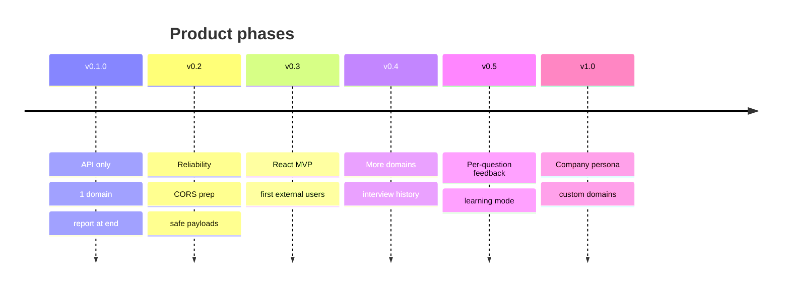
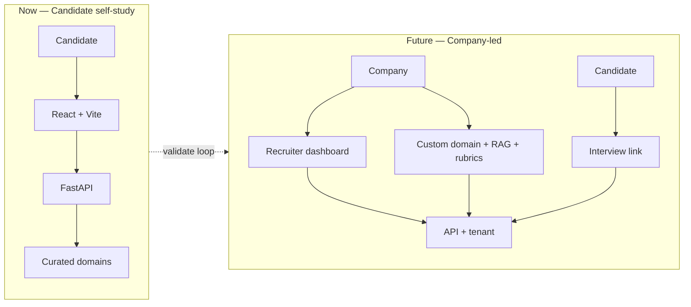

# Product Roadmap — interview-agent

Strategic product direction for **interview-agent** (~v0.1.0).  
Derived from **roadmap-produto-agent** analysis (Aug 2026) and product decisions by Miller.

For engineering execution, see [`technical_roadmap.md`](./technical_roadmap.md).  
For tactical debt and checkboxes, see [`todo.md`](./todo.md).

---

## Product vision

**Near term:** a self-study platform where **candidates practice technical interviews alone** — adaptive questions, RAG-grounded evaluation, and a structured report at the end.

**Long term:** a platform where **companies run interviews** — assign domains, review candidate reports, and eventually bring their own domain content (documents for RAG, rubrics, question banks).

---

## Decisions locked in

| # | Topic | Decision |
|---|-------|----------|
| 1 | **Primary persona (now)** | Candidate practicing alone (B2C / self-study) |
| 1b | **Secondary persona (future)** | Company / recruiter applying interviews to candidates |
| 2 | **Feedback timing (now)** | Report only at the end of the interview — no per-turn feedback in the API |
| 2b | **Feedback timing (future)** | Optional per-question feedback so candidates learn how they should have answered |
| 3 | **Frontend** | React + Vite — planned soon |
| 4 | **Domain strategy (now)** | Expand curated domains (Kafka, RabbitMQ, etc.) maintained by the project |
| 4b | **Domain strategy (future)** | Companies can define a custom domain: upload RAG documents, rubrics, and question banks |
| 5 | **Distribution (now)** | Public hosted instance (Miller pays LLM cost initially) |
| 5b | **Distribution (future)** | Optional BYOK — users supply their own `GROQ_API_KEY` / `OPENROUTER_API_KEY` to use their models |
| 6 | **Usage limits** | Not defined yet — per-user caps (e.g. interviews/day) should be considered before wide public launch |
| 7 | **Frontend deploy** | Separate deploy (e.g. Vercel for SPA + API on its own host/subdomain) |
| 8 | **Auth (v0.3)** | Bearer token in frontend storage for MVP |
| 8b | **Auth (future)** | Migrate to httpOnly cookies |
| 9 | **New domains** | Add multiple curated domains over time (Kafka, RabbitMQ, etc.) — no single “next domain” locked |
| 10 | **Session length** | Customizable per interview (candidate chooses duration / question count) |
| 11 | **v0.3 testers** | Miller can recruit 3–5 people for the first external validation |
| 12 | **v0.3 success metric** | **Default:** candidate completes the full flow without technical help — no formal report-quality score required for v0.3 |
| 13 | **Company custom domains** | Self-serve upload with a **document limit** per domain/tenant |
| 14 | **Per-question feedback format (v0.5)** | **TBD** — rubric hints vs model-generated ideal answers |

---

## Current state (v0.2 shipped — v0.3 next)

### What exists

| Dimension | State |
|-----------|-------|
| API | 9 endpoints — auth, discovery, full interview lifecycle |
| Domains | 1 (`async_messaging`): 5 topics, 35 questions, 12 RAG documents |
| Agents | Orchestrator + Evaluator (text parse) + Reporting (structured output) |
| UX | OpenAPI / curl only — **no frontend** |
| Embeddings | **fastembed** (ONNX) in-process |
| RAG seed | Decoupled job (`run_seed.py` + compose profile `seed`); manifest hash |
| RAG readiness | **`503 RAG_NOT_READY`** on `start_interview` when empty/stale |
| Deploy | Docker Compose; multi-stage image **~144 MB** (CI gate 650 MB); Qdrant pinned `v1.19.0` |
| Tests | Unit + API + integration in CI |

### Validated vs assumed

| Validated (evidence in code/CI) | Assumed (not tested with real users) |
|---------------------------------|--------------------------------------|
| Agent pipeline works end-to-end | Candidates want this without a polished UI |
| One domain with curated content | `async_messaging` is the right first niche |
| Final report delivers enough value | Hiding per-turn feedback improves the experience |
| Groq + OpenRouter cover LLM needs | Cost per session is sustainable at scale |
| Domain registry scales to new topics | Users will return for a second interview |

**Summary:** the **technical MVP** exists. The **product MVP** — something a non-technical candidate completes without help — does not yet.

---

## Value by persona

| Persona | Value today | Value in roadmap |
|---------|-------------|------------------|
| **Candidate (self-study)** | Practice flow + final report via API | React UI, more domains, replay variety, optional per-question feedback |
| **Company / recruiter** | None | Assign interviews, view reports, custom domains + RAG + rubrics |
| **Builder (Miller)** | Solid stack, CI, extensible architecture | Dogfooding, controlled LLM cost, steady shipping cadence |

---

## Effort vs impact (product lens)

### Do early — high impact, low/medium effort

| Item | Product value |
|------|---------------|
| Reliable evaluator (structured output) | Sessions complete without `503` mid-interview |
| Answer payload limits | Safe public exposure before frontend |
| Question randomization | Less repetitive practice sessions |
| CORS + basic rate limiting | Required for separate frontend deploy (cross-origin API calls) |
| Readiness endpoint (`/ready`) | Orchestrators detect Postgres/Qdrant outages |

### Do next — high impact, higher effort

| Item | Product value |
|------|---------------|
| **React + Vite frontend** | Unblocks real candidate usage |
| **Second domain** (e.g. Kafka) | Broader appeal; validates multi-domain story |
| Expand questions / RAG per domain | Retention; second interview still feels fresh |
| Interview history ("my interviews") | Return visits; progress over time |

### Defer — until validated or persona shifts

| Item | Why wait |
|------|----------|
| A2A + message queues | No integrator or validated B2B use case yet |
| Company custom domains + upload | Requires multi-tenant, auth roles, ingestion UX |
| Per-question feedback | Explicit future feature; ship report-only first |
| Ollama / local LLM fallback | Groq works; adds ops before real cost pain |
| Recruiter dashboard | Secondary persona; doubles scope |
| Data pipeline (PDF/web ingest at scale) | Manual YAML curation is enough for 2–3 domains |
| Terraform / AWS | Compose is enough for validation phase |

---

## Phased roadmap

### v0.1.0 — Backend MVP *(shipped)*

- REST API, one domain, agents + RAG, Docker, CI  
- **North star:** a developer can run a full interview via API

---

### v0.2 — Reliable enough to demo *(shipped — remaining polish below)*

**Theme:** remove friction and failure modes before investing heavily in UI and content.

| Deliverable | Product outcome |
|-------------|-----------------|
| Structured output in Evaluator | Fewer abandoned sessions |
| `max_length` on answers/passwords | Safe to expose |
| Question randomization | Practice feels less scripted |
| CORS (prep for React) | Frontend can call API from browser |
| Readiness endpoint (`/ready`) | Host detects dependency failures |

**North star:** *"I can host this and complete 10 interviews in a row without a 503."*

**Suggested metrics**

- 10 consecutive interviews without LLM failure  
- Cold start under 30s on API restart (seed skip when manifest matches)  
- Image under 650 MB *(achieved — ~144 MB)*

---

### v0.3 — First real candidate

**Theme:** someone who is not a REST power user can finish an interview.

| Deliverable | Product outcome |
|-------------|-----------------|
| React + Vite SPA (separate deploy) | Login → pick domain/topic → answer → report |
| CORS configured for frontend origin | Cross-origin API from Vercel (or similar) to API host |
| Bearer token in `localStorage` | Auth for v0.3; httpOnly cookies deferred |
| Loading / error states, report retry UX | Trust when LLM hiccups |
| Rate limiting on auth | Basic abuse protection on public instance |

**MVP frontend scope (intentionally narrow)**

- Register / login  
- Choose domain, topic, difficulty  
- Question screen + submit  
- Final report screen  
- No dashboard, no history, no profile editing  

**North star:** *"3–5 people outside the project complete an interview without curl or Swagger."*

**Success criterion (v0.3):** completion without technical assistance — finishing register → login → all questions → report view. Qualitative feedback from testers is a bonus, not a gate.

**Suggested validation**

- Short post-interview survey: Was the report useful? Would you do another? What domain next?

---

### v0.4 — Content and retention

**Theme:** make a second session worth doing.

| Deliverable | Product outcome |
|-------------|-----------------|
| New curated domains (Kafka, RabbitMQ, …) | Broader audience; multi-domain registry proven in production |
| Customizable session length | Candidate picks interview duration / question count |
| Basic history ("my past interviews") | Return visits |
| More questions + RAG per domain | Less repetition |

**North star:** *"At least one person comes back for a second interview voluntarily."*

---

### v0.5 — Candidate experience polish

**Theme:** deepen self-study value before B2B.

| Deliverable | Product outcome |
|-------------|-----------------|
| Per-question feedback (post-session review) | Learning mode — see ideal answers after finishing |
| Progress by topic / difficulty | Sense of improvement |
| Optional practice mode (lighter persistence) | Lower barrier to try |

**North star:** *"Candidates say they learned something concrete from the session."*

---

### v1.0 — Company persona (direction TBD)

**Theme:** shift from solo practice to **interviews applied by organizations**.

| Capability | Notes |
|------------|-------|
| Organization accounts + roles | Admin vs candidate |
| Assign interview (domain, topic, difficulty) | Company initiates; candidate receives link/token |
| Recruiter view of reports | Read-only; no cross-candidate leak |
| **Custom domain** (self-serve) | Company uploads RAG docs, rubrics, questions — with per-domain document limits |
| BYOK (bring your own API keys) | Optional path for companies or power users to use their LLM accounts |
| Usage limits + quotas | Per-user/org caps before monetization is defined |

**North star:** *"One company runs a pilot interview with 3 candidates and reviews reports in a dashboard."*

---

## Architecture evolution (product view)

---

## MVP gaps (blocking real usage)

Ordered by how much they block a candidate today:

1. **No frontend** — primary blocker for v0.3  
2. **Evaluator reliability** — parse failures abort sessions  
3. **First-boot seed job** — operator must run `docker compose --profile seed` once (documented; not self-service for non-technical hosts)  
4. **Question repetition** — deterministic first question per topic  
5. **Finite content** — 35 questions; power users exhaust variety quickly  
6. **No public hardening** — rate limits needed when React ships  
7. **Single domain** — limits audience to async-messaging learners  

Not blocking the first external candidate: A2A, custom company domains, Ollama, Terraform.

---

## Unvalidated assumptions

| Hypothesis | Risk if wrong |
|------------|---------------|
| Final report alone is enough for v0.3 | Users abandon mid-session or don't return |
| Candidates care about async messaging first | Low adoption even with UI |
| Self-study is the right wedge before B2B | Building company features too early |
| Default session length with customization is intuitive | Too many options confuse; too few feel rigid |
| Curated domains beat user-generated content early | Slower growth but higher quality — trade-off unproven |
| Groq free/low tier sustains early public usage | Rate limits force infra work before product fit |

**Minimum experiment before v1.0 B2B:** 5 external candidates, one interview each, structured feedback on report usefulness and missing domains.

---

## Explicit non-goals (current phase)

- A2A protocol and agent-to-agent orchestration  
- Company-uploaded domains and document ingestion UI  
- Real-time per-turn feedback during the interview  
- Recruiter analytics and hiring pipeline integrations  
- Monetization / billing (usage limits yes; pricing model not yet defined)  
- Mobile-native apps (responsive web is enough for MVP)  

---

## Relationship to other docs

| Document | Focus |
|----------|--------|
| **`product_roadmap.md`** (this file) | Personas, phases, product priorities, validation |
| **`technical_roadmap.md`** | Architecture horizons, ADRs, scale bottlenecks |
| **`todo.md`** | Actionable engineering backlog with severity |

When a product phase starts, trace deliverables to `technical_roadmap.md` initiatives and `todo.md` checkboxes.

---

## Still open

| # | Topic | Status |
|---|-------|--------|
| A | **Usage limits** | Acknowledged — define caps (interviews/day, tokens) before public launch |
| B | **Per-question feedback format (v0.5)** | Rubric hints vs model-generated ideal answers — decide closer to v0.5 |
| C | **Customizable session length** | Product decision yes — API/schema design TBD (preset tiers vs free number?) |
| D | **Document limit for company domains** | Self-serve yes — max docs/MB per domain not set |
| E | **BYOK UX** | Future — when and how users attach API keys in settings |

---

*Last updated: August 2026*
