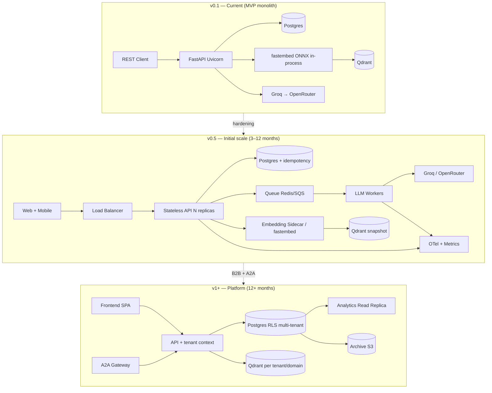

# Technical Roadmap — interview-agent

Strategic architecture and evolution plan for **interview-agent** (~v0.1.0).  
Derived from **analista-generico-agent** (code review, Aug 2026) and **sugestoes-arquiteturais-agent** (scale & future direction).

For tactical debt and checkboxes, see `[todo.md](./todo.md)`.

---

## Current architectural vision

The project is a **FastAPI monolith** with clear layering (`api` → `services` → `repositories` → `agents`), multi-domain registration via `app/core/domain/registry.py` (currently only `async_messaging` in `app/domains/async_messaging/bootstrap.py`), Postgres persistence with useful constraints (`uq_interviews_candidate_active`, `uq_interview_turn_number` in `app/core/db/models.py`), RAG on Qdrant (`app/core/rag/`) with **fastembed** (ONNX) in-process embeddings (`app/core/rag/embeddings.py`), and LLM via Groq → OpenRouter fallback (`app/core/llm/fallback.py`).

The critical `submit_answer` path in `InterviewService` is **synchronous per request**: evaluate with LLM + RAG, optionally generate report on the final turn, then persist. This is a deliberate trade-off (documented in `todo.md`).

Singletons via `@lru_cache` (`get_llm_chain`, `get_embedding_provider`, `get_cached_domain`) make the API *almost* stateless for HTTP, but **stateful in-process** for the embedding model and Qdrant clients. The Docker entrypoint (`scripts/docker-entrypoint.sh`) runs **migrations + Uvicorn only**; Qdrant seed is a separate compose profile job (`scripts/run_seed.py`, ADR-005). `start_interview` fails fast with **`503 RAG_NOT_READY`** when the collection is empty or the manifest is stale. Production image is **~144 MB** (multi-stage build; CI hard gate at 650 MB).

### Strengths to preserve

| Area           | What works well                                                                       |
| -------------- | ------------------------------------------------------------------------------------- |
| Layering       | Domain exceptions decoupled from HTTP; clean service/repository split                 |
| Multi-domain   | `DomainModule` + `register_domain()` + per-domain bootstrap                           |
| LLM resilience | Groq → OpenRouter with transient/permanent error classification                       |
| Persistence    | Partial unique indexes, `DuplicateTurn` handling, nested savepoint for report races   |
| Auth           | Argon2, opaque tokens with SHA-256 hash, no PII in logs                               |
| Tests          | Unit + API + integration in CI; LLM fakes, transactional fixtures, integration with state rehydration |

---

## Structural bottlenecks for scale

| Bottleneck                          | Location                                                                         | Why it limits scale                                                                                                                   |
| ----------------------------------- | -------------------------------------------------------------------------------- | ------------------------------------------------------------------------------------------------------------------------------------- |
| Embeddings in API process | `EmbeddingProvider`, `Dockerfile` | fastembed in-process; thread-pool contention (`asyncio.to_thread` in `EvaluatorAgent`) under high concurrency |
| LLM on critical HTTP path           | `InterviewService.submit_answer` → `OrchestratorAgent`                           | High P95 latency (RAG + evaluate + report); no backpressure; token cost on retry/duplicate                                            |
| Fragile evaluator parsing           | `EvaluatorAgent._parse_response()` vs `ReportingAgent` + `generate_structured()` | Intermittent failures → `503 LLM_UNAVAILABLE`; architectural inconsistency between agents                                             |
| Health without readiness            | `app/api/main.py` `/health`                                                      | Orchestrator marks pod healthy when Postgres/Qdrant is down                                                                           |
| No queue/workers                    | Everything in Uvicorn                                                            | Cannot decouple LLM spikes from HTTP throughput; no DLQ for failed reports                                                            |
| Partial idempotency                 | DB constraints + LLM before commit                                               | `DuplicateTurn` protects turn integrity, but duplicate submit already spent tokens                                                    |
| Minimal observability               | `app/core/logging.py` plain text                                                 | No `request_id`, no token/latency/cost metrics per interview                                                                          |
| No multi-tenant model               | Flat `candidates`, no `tenant_id`                                                | B2B would share the same namespace                                                                                                    |
| Domain coupled to deploy            | In-memory registry at startup                                                    | New domain requires redeploy; Qdrant collections per domain without central governance                                                |

---

## Evolution horizons

### Short term (0–3 months) — harden the MVP

| #   | Initiative                              | Problem                                                   | Approach                                                                    | Effort     |
| --- | --------------------------------------- | --------------------------------------------------------- | --------------------------------------------------------------------------- | ---------- |
| 1   | **Liveness vs readiness**               | `/health` returns OK without dependency checks            | `/health` (liveness) + `/ready` with Postgres + Qdrant ping                 | Low        |
| 2   | **Structured output in evaluator**      | Text parsing (`NIVEL:`/`FEEDBACK:`) vs JSON in reporter   | Pydantic schema + `generate_structured()` (mirror `reporting_schema.py`)    | High       |
| 3   | **Idempotency-Key on submit**           | Client retry after timeout wastes LLM tokens              | HTTP header → `idempotent_requests` table (key, response, TTL 24h)          | Medium     |
| 4   | **Payload limits + basic cost logging** | No `max_length` on answers; tokens not structured in logs | Schema limits (4–8 KB); log `tokens_used` from `LLMResponse`                | Low        |
| 5   | **Test hardening**                      | Alembic drift, missing security API tests                 | Alembic in fixtures; ownership 404, report retry, duplicate turn tests      | Low–Medium |

**Target outcome:** Reliable single-replica deploy, stable LLM pipeline, safe public exposure.

---

### Medium term (3–12 months) — prepare horizontal scale

| #   | Initiative                    | Problem                                                      | Approach                                                                                           | When                                   |
| --- | ----------------------------- | ------------------------------------------------------------ | -------------------------------------------------------------------------------------------------- | -------------------------------------- |
| 8   | **Async LLM workers**         | `submit_answer` blocks until evaluate (+ report) completes   | Persist turn as `pending_evaluation` → queue (Redis Streams / SQS) → worker updates turn           | >50 concurrent submits or P95 > SLA    |
| 9   | **Embedding sidecar**         | `EmbeddingProvider` singleton per replica multiplies RAM     | Microservice with fastembed/ONNX, or hosted API + Redis cache by text hash                         | 3+ API replicas or fastembed migration |
| 10  | **LLM circuit breaker**       | Sequential Groq → OpenRouter without shared state under peak | Per-provider circuit breaker (Redis); deferred report retry                                        | Recurring rate limits                  |
| 11  | **RAG cache**                 | Every `evaluate()` embeds answer and queries Qdrant          | LRU by `(topic, answer_hash)` or pre-computed context per `question_id`                            | RAG >30% of evaluate latency           |
| 12  | **Distributed observability** | Plain-text logs, no correlation                              | JSON logs + `request_id`; OpenTelemetry; Prometheus (`llm_tokens_total`, `submit_latency_seconds`) | Team >1 or SLO defined                 |
| 13  | **Multi-domain governance**   | `DomainEnum` placeholders; dead `get_active_domain()`        | Plugin per `domains/<name>/` (bootstrap, Qdrant collection, versioned YAML); feature flags         | 2nd real domain (e.g. Kafka)           |
| 14  | **Auth lifecycle**            | Tokens accumulate without purge                              | Periodic `DELETE WHERE expires_at < now()`; `POST /auth/logout`                                    | Before public registration             |
| 15  | **Separate** `InterviewState` | Metadata, history, report mixed (`interfaces.py` TODO)       | `InterviewSession` + `InterviewHistory`                                                            | Before E2E complexity grows            |

**Target outcome:** Stateless API replicas, observable LLM cost, second domain live, optional async evaluate.

---

### Long term (12+ months) — platform & multi-tenant

| #   | Initiative                    | Problem                                                   | Approach                                                                             | When                                   |
| --- | ----------------------------- | --------------------------------------------------------- | ------------------------------------------------------------------------------------ | -------------------------------------- |
| 16  | **Multi-tenant (B2B)**        | Flat B2C model                                            | `organizations`, `members`, `tenant_id`; Postgres RLS; Qdrant `tenant_domain` prefix | Product pivots to companies/recruiters |
| 17  | **A2A protocol**              | REST-only synchronous integration                         | Agent Card; async tasks via messaging; `OrchestratorAgent` as coordinator            | External agent ecosystem               |
| 18  | **Data partitioning**         | `interview_turns` + JSONB grows linearly                  | Partition by `created_at`; read replica for reports/analytics; cold archive (S3)     | >1M interviews                         |
| 19  | **Intelligent model routing** | Same model for evaluate and report; no budget             | Smaller model for evaluate, larger for report; daily quota per tenant                | LLM cost >10% of ops budget            |
| 20  | **Frontend + streaming**      | No CORS; no SSE/WebSocket; feedback hidden from candidate | SPA with SSE for progress; optional `FallbackLLMProvider.stream`                     | Interactive UX replaces REST client    |

**Target outcome:** B2B-ready platform with tenant isolation, async agent integration, and cost controls.

---

## Architecture decision records (candidates)

| ADR     | Topic                 | Proposed decision                                      | Alternatives                                |
| ------- | --------------------- | ------------------------------------------------------ | ------------------------------------------- |
| ADR-001 | Where embeddings run  | In-process until 2 replicas; then fastembed sidecar    | Hosted embedding API; GPU node pool         |
| ADR-002 | Sync vs async LLM     | Sync until frontend ships; queue when P95 exceeds SLA  | Aggressive timeout only                     |
| ADR-003 | Unified LLM contract  | Pydantic structured output for evaluate **and** report | Tool calling; few-shot text parsing         |
| ADR-004 | Submit idempotency    | `Idempotency-Key` HTTP + Postgres table                | DB constraints only (`DuplicateTurn`)       |
| ADR-005 | Qdrant seed strategy  | Init job + manifest hash; see [ADR-005](./adr/ADR-005-qdrant-seed-strategy.md) | Conditional seed in entrypoint              |
| ADR-006 | Observability stack   | OpenTelemetry + JSON structured logs                   | Extra log fields only (interim)             |
| ADR-007 | Multi-tenant model    | `tenant_id` + Postgres RLS when B2B                    | Schema per tenant; single-tenant per deploy |
| ADR-008 | Candidate feedback    | Keep hidden (current) or expose level only             | Full real-time feedback                     |
| ADR-009 | Message queue         | Redis Streams → SQS in production                      | Celery; Kafka (overkill for MVP)            |
| ADR-010 | Interview state model | Split `InterviewSession` / `InterviewHistory`          | Keep monolithic `InterviewState`            |

---

## Anti-patterns to avoid

1. **Scale API replicas without fixing embeddings** — each pod loads fastembed in-process; linear RAM cost and multiplied cold starts (sidecar deferred until 2+ replicas).
2. **Microservices before async workers** — the bottleneck is synchronous LLM, not api/services separation.
3. **Swap embedder without re-indexing** — vectors from `all-MiniLM-L6-v2` are not comparable to fastembed or other models.
4. **Cache LLM responses without versioning prompt/schema** — evaluate v2 + cache v1 breaks report consistency.
5. **Circuit breaker without shared state** — N replicas each open/close independently.
6. **Multi-tenant as afterthought** — adding `tenant_id` after thousands of interviews is painful.
7. **A2A over long synchronous HTTP** — external agent timeouts conflict with 5–15s evaluate latency.
8. **Rely on DB constraints alone for idempotency** — `DuplicateTurn` protects integrity, not token cost.
9. **Single health check for everything** — mixing liveness with Qdrant checks causes restart loops.
10. **Dynamic domain registry without versioning** — changing rubrics/questions at runtime invalidates active interviews.

---

## Functional roadmap (prioritized)

| Priority | Feature                                               | Technical dependency               | Value                            |
| -------- | ----------------------------------------------------- | ---------------------------------- | -------------------------------- |
| **P0**   | Readiness endpoint (`/ready`)                         | Postgres + Qdrant ping             | Reliable operations              |
| **P0**   | Structured evaluate + payload limits                  | ADR-003                            | LLM stability                    |
| **P1**   | Candidate frontend (auth, interview flow, report)     | CORS, idempotency (ADR-004)        | Usable product                   |
| **P1**   | Second domain (e.g. Kafka)                            | Domain plugin + ingestion pipeline | Validates multi-domain registry  |
| **P2**   | Recruiter dashboard (list interviews, view reports)   | Light multi-tenant or roles        | Initial B2B                      |
| **P2**   | Async report retry with notification                  | Workers/queue (ADR-009)            | Post-LLM-failure UX              |
| **P3**   | Progress streaming (SSE)                              | Worker or LLM stream               | Premium UX                       |
| **P3**   | Document ingestion (PDF/web) per domain               | ETL pipeline                       | Rich RAG                         |
| **P4**   | A2A agent card + tasks                                | Messaging                          | Agent ecosystem                  |
| **P4**   | Analytics (level distribution, weak topics)           | Observability + read replica       | Insight for candidates/companies |
| **P5**   | Practice simulator (no persistence)                   | Rate limit + quota                 | User acquisition                 |

---

## Architecture evolution diagram

---

## Dimension summary

| Dimension           | Current state                                                       | Recommended direction                                               |
| ------------------- | ------------------------------------------------------------------- | ------------------------------------------------------------------- |
| Horizontal scale    | fastembed in-process; lean image (~144 MB); seed decoupled via init job | Stateless API + embedding sidecar at 2+ replicas |
| Distributed systems | Monolith; strong Postgres consistency                               | Queue for evaluate/report; eventual feedback; multi-tenant with RLS |
| Concurrency / locks | Good: partial unique index + `DuplicateTurn`                        | + `Idempotency-Key`; explicit optimistic lock on turn               |
| Resilience          | LLM provider fallback; report retry via GET                         | Circuit breaker; DLQ; degrade to "evaluation pending"               |
| LLM pipeline        | Split evaluate (text) vs report (JSON)                              | Unified structured output; model routing; token metrics             |
| RAG / embeddings    | fastembed in-process; manifest + fail-fast start; sync thread pool | Sidecar or hosted API at scale; cache; warm pool                          |
| Observability       | Text logs with `interview_extra`                                    | JSON + traces + SLOs on submit/report                               |
| Functional roadmap  | 1 domain, API-only                                                  | Frontend → 2nd domain → B2B → A2A                                   |

---

## Relationship to `todo.md`

| Document                           | Purpose                                                                          |
| ---------------------------------- | -------------------------------------------------------------------------------- |
| `todo.md`                          | Actionable backlog with severity, checkboxes, and quick-reference priority table |
| `technical_roadmap.md` (this file) | Strategic direction, ADRs, horizons, and functional priorities                   |

When an item moves from roadmap to execution, add or update the corresponding checkbox in `todo.md` and optionally record the ADR decision in a future `docs/adr/` folder.

---

*Last updated: August 2026*